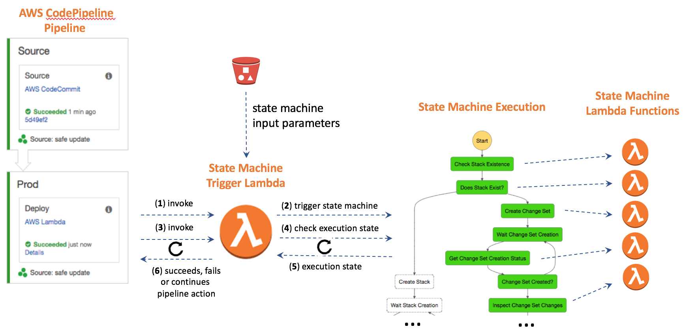

Welcome to __aws-codepipeline-stepfunctions__ project! 

How about delegating complex CodePipeline tasks to a proper state machine and keep your pipeline clean and and easy to understand? 



This AWS Labs project shows how to integrate AWS CodePipeline and AWS Step Functions state machines. The integration enables developers to build much simpler CodePipeline actions that perform a single task and to delegate the complexity of dealing with workflow-driven behavior associated with that task to a proper state machine engine. As such, developers will be able to build more intuitive pipelines and still being able to visualize and troubleshoot their pipeline actions in detail by examining the state machine execution logs.

## Required Software

Please install the following software in your local workstation before proceeding:

* [Git client](https://git-scm.com/downloads)

* [AWS Command Line Interface](http://docs.aws.amazon.com/cli/latest/userguide/installing.html) (version 1.11.170 or greater)

* Configure your AWS credentials and make sure your credentials allow you to create all required resources (S3, CodeCommit, CodePipeline, Lambda, StepFunctions, IAM): 

```bash
aws configure
```

* Install [npm](https://www.npmjs.com/get-npm)

If you plan to develop and contribute to the project it's a good idea to use SAM Local:

* [AWS SAM Local](https://github.com/awslabs/aws-sam-local)

## Directory structure

* __app/__ - contains a CloudFormation template that represents the application being deployed via CodePipeline/Step Functions.

* __pipeline/codepipeline__ - CodePipeline resources

* __pipeline/statemachines__ - Step Functions resources including the _Deploy_ state machine

* __pipeline/local_modules__ - required local npm modules

## Instructions

### Make all scripts executable

From the project's root directory, type:

```bash
chmod u+x **/*.sh
```

### Install required NPM modules

From the project's root directory, type:

```bash
  cd pipeline/
  install_dependencies.sh
```

### Deploy Resources

* Clone this project in your local workstation (git clone ...)

* If you wish to use your _default_ AWS profile skip this step, otherwise open script file _config.sh_ and enter your profile using variable _AWS\_PROFILE_.

```bash
vi pipeline/config.sh
```

Important: Make sure the AWS profile chosen refences an AWS region that supports AWS Step Functions [(check here)](https://aws.amazon.com/about-aws/global-infrastructure/regional-product-services/).

* From the project's root directory run:

```bash
  cd pipeline/
  ./bootstrap.sh [AWS-PROFILE-NAME]
```

The _Default_ profile will be used if no profile is specified.

The _bootstrap_ script will create all necessary resources including:

* S3 buckets for CodePipeline, Lambda and State Machine
* CodeCommit repository
* Several Lambda functions for CodePipeline and Step Functions 
* The Step Functions state machine
* The CodePipeline pipeline

### Push Code and Trigger CodePipeline

You can now open the AWS Console and check the various resources created for you. Note that the CodePipeline pipeline is in a failing state since the CodeCommit repository does not have any code. The next step will be to push code to CodeCommit which will then trigger the pipeline. 

* Using the AWS Console, navigate to the CodeCommit repository created for you

* Follow [these instructions](http://docs.aws.amazon.com/codecommit/latest/userguide/how-to-connect.html) to retrieve your CodeCommit's SSH or HTTP clone URL

* From the project's root directory, type:

```bash
  cd app/
  git init && git add --all
  git commit -m "initial commit"
  git remote add codecommit [YOUR-CODECOMMIT-REPO-CLONE-URL]
  git push codecommit master
```

## Contributing

### Running Locally

If you wish to contribute to the project it's definitely a good idea to use [AWS SAM Local](https://github.com/awslabs/aws-sam-local) to run and debug Lambda functions locally. A _run\_local.sh_ script is available under _pipeline/codepipeline_ and _pipeline/statemachine/deploy_ for convenience.

In order to run Lambda functions locally, SAM local requires test event to be passed as input to the Lambda functions. Sample test events are provided under _test\_events_/ and might contain account-specific parameters that must be customized. 

Here's an example of how to invoke the _CreateStackStateMachineTask_ Lambda function:

```bash
  cd pipeline/statemachines/deploy
  ./run_local.sh CreateStackStateMachineTask create_stack
```

Note that template _state\_machine\_template.yaml_ and test event file _test\_events/event\_create\_stack.json_ are referenced within the script.

### Local Modules

Changes to local modules (under _pipeline/local\_modules) require that the modules that include these local modules are updated.

This can be accomplished by running these templates:

```bash
 # pack changes made to local modules
 cd pipeline/local_modules
 ./pack_modules.sh
   
 # update local modules for codepipeline
 cd pipeline/codepipeline
 ./install_modules.sh
   
 # update local modules for statemachines deploy
 cd pipeline/statemachines/deploy
 ./install_modules.sh
```

Have fun and contribute!